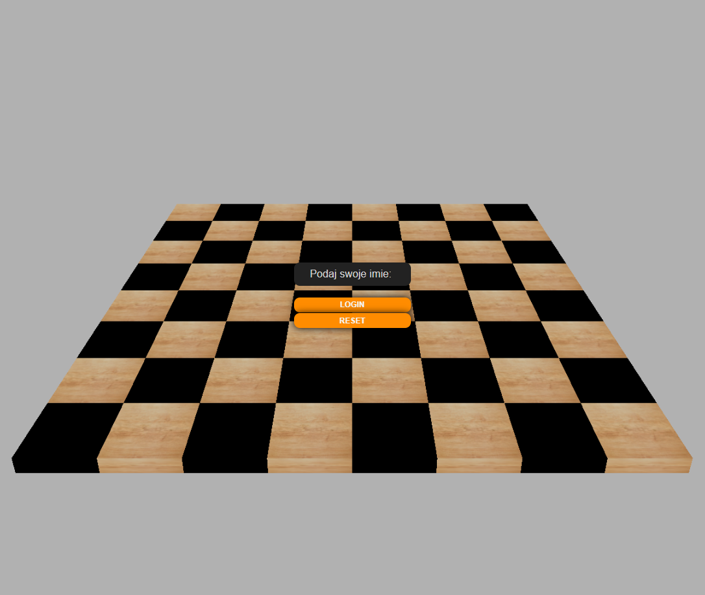
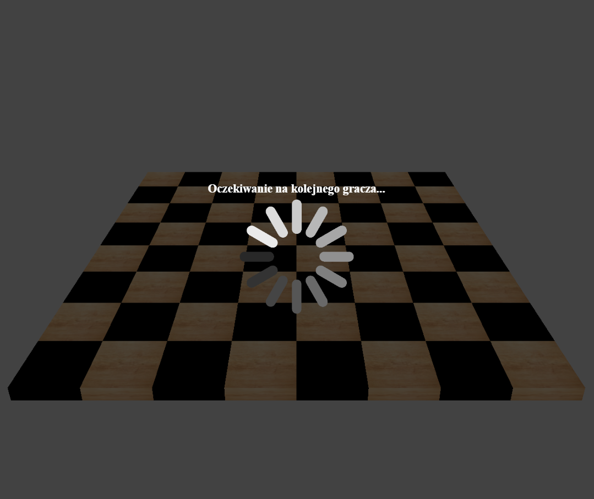
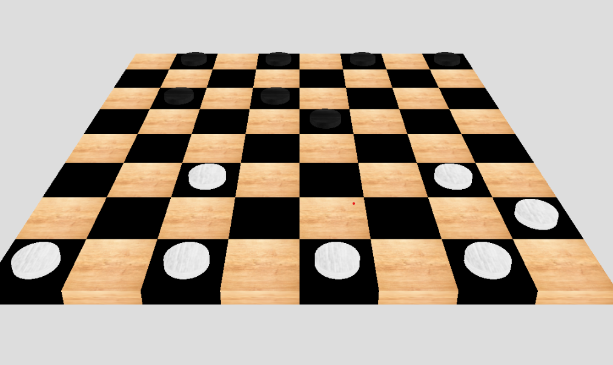
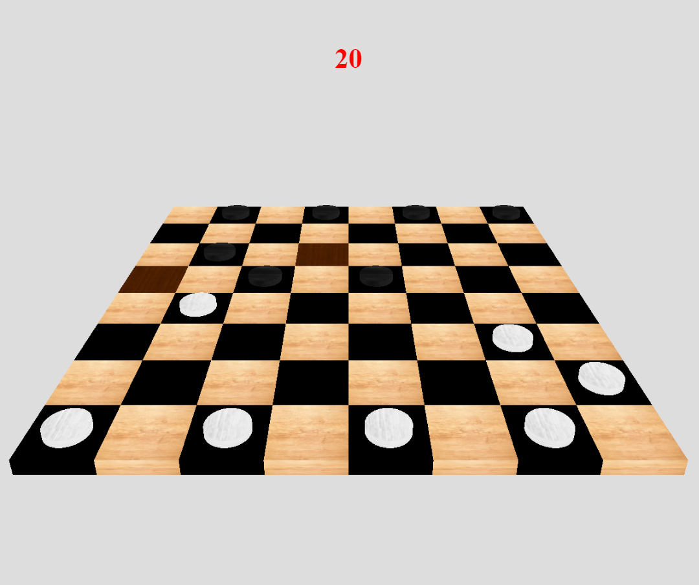
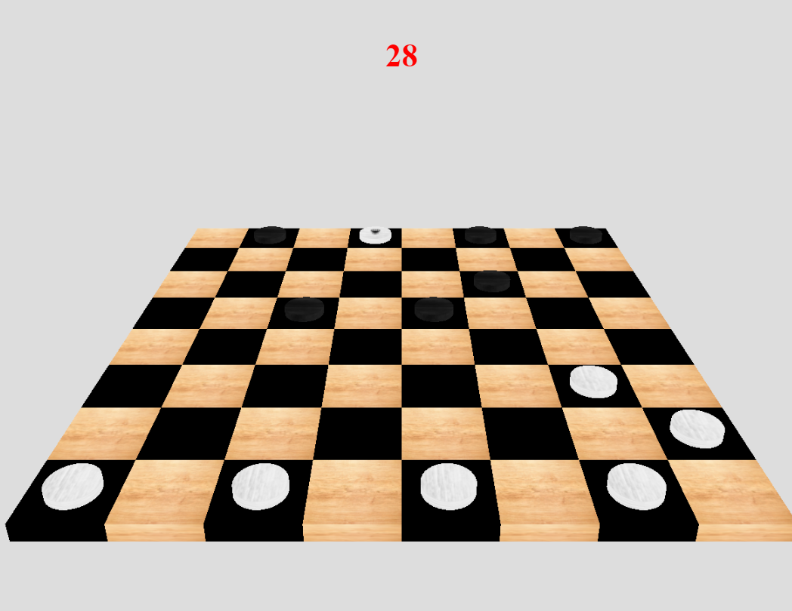

# 🎮♛ **2 Player 3D Checkers** ♛🎮
## **Play with your friends on your local server**

### **Used technologies:**
1. NodeJS 
2. ExpressJS 
3. ThreeJS
4. TweenJS (for ThreeJS animations)


### **Launch the application on local machine:**  
1. Enter the project directory
2. Install dependencies
```
npm install
``` 
3. Run the application on your local server
```
node index
```
4. Log into app on 2 different pages and enjoy 🎉


### 🖼️ **Images of the game** 





